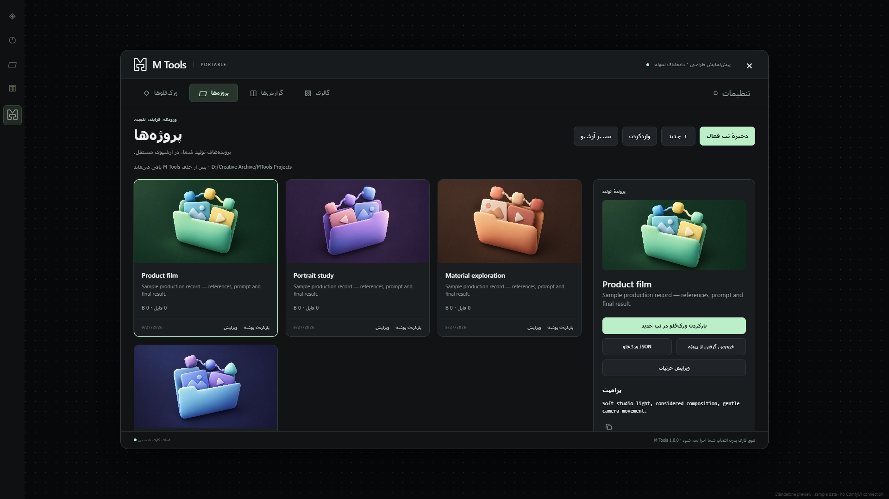

# M Tools

**فضای کاری محلی شما در ComfyUI Portable**؛ برای مدیریت ورک‌فلوها، پرونده‌های تولید، مدل‌ها و خروجی‌ها.

[English](README.md) · [دانلود نسخهٔ ۱](https://github.com/maisamh80/MTools/releases/tag/v1.0.0) · [گزارش مشکل](https://github.com/maisamh80/MTools/issues)



## امکانات

- **ورک‌فلوها:** ذخیرهٔ تب فعال یا واردکردن JSON، توضیحات و تگ و کاور دلخواه، بررسی نیازمندی‌ها، بازکردن در تب جدید، ویرایش، بازیابی نسخه و خروجی JSON یا بستهٔ مدل‌ها.
- **پروژه‌ها:** نگهداری فایل‌های مرجع، پرامپت، JSON ورک‌فلو، تنظیمات نودها و خروجی نهایی در آرشیوی مستقل. ثبت خودکار تب فعال، ساخت دستی و واردکردن پروژهٔ آماده. فایل مدل‌ها و کد کاستم‌نودها وارد این آرشیو نمی‌شوند.
- **گزارش‌ها:** حجم فضای نصب و مدل‌ها، همهٔ پوشه‌ها حتی پوشه‌های خالی، مسیر و اندازهٔ فایل‌ها، جست‌وجو و دریافت CSV یا JSON.
- **گالری:** مرور تصاویر، ویدیوها و سایر خروجی‌ها، نمایش در پوشه، بکاپ انتخاب‌شده‌ها یا همهٔ خروجی‌ها و حذف دائمی با تأیید کاربر.
- **فارسی و انگلیسی:** از تنظیمات زبان را تغییر دهید. فقط متن رابط و جهت خواندن آن تغییر می‌کند؛ جای پنل‌ها و کارت‌ها ثابت است. نام مدل‌ها، مسیرها، پرامپت و محتوای شما ترجمه نمی‌شوند.

## نصب آسان؛ بستهٔ کامل

این نسخه برای **ویندوز ۶۴بیتی و ComfyUI Portable** است. خود ComfyUI باید از قبل نصب و قابل اجرا باشد.

۱. از [بخش Releases](https://github.com/maisamh80/MTools/releases/latest) فایل **MTools-1.0.0-Windows-x64-Full.zip** را بگیرید.
۲. ComfyUI را ببندید.
۳. پوشهٔ `MTools` داخل ZIP را در `ComfyUI/custom_nodes` قرار دهید.
۴. ComfyUI را با لانچر معمول خود اجرا کنید؛ آیکون M Tools زیر Templates ظاهر می‌شود. در صورت نیاز صفحه را با Ctrl+F5 تازه‌سازی کنید.

```text
ComfyUI_windows_portable/ComfyUI/custom_nodes/MTools/__init__.py
ComfyUI_windows_portable/ComfyUI/custom_nodes/MTools/runtime/python/python.exe
```

پوشهٔ تودرتوی `MTools/MTools` نسازید. **پایتون مستقل داخل بستهٔ Full است**؛ نصب پایتون، pip، دستور آماده‌سازی یا دانلود جداگانه لازم نیست. فایل خودکار «Source code» گیت‌هاب بستهٔ کامل نیست.

## نصب از سورس گیت‌هاب

در پوشهٔ `ComfyUI/custom_nodes` این دستورها را اجرا کنید:

```powershell
git clone https://github.com/maisamh80/MTools.git MTools
cd MTools
powershell -NoProfile -ExecutionPolicy Bypass -File .\scripts\Prepare-Runtime.ps1
```

این روش یک بار برای دانلود پایتون رسمی به اینترنت نیاز دارد و صحت آرشیو با SHA-256 بررسی می‌شود. برای بستهٔ Full یا نصب دارای `runtime/python` دستور آماده‌سازی را دوباره اجرا نکنید.

## استقلال و محل داده‌ها

پل ارتباطی داخل ComfyUI اجرا می‌شود، اما عملیات فایل‌ها را پایتون مستقل افزونه انجام می‌دهد. هیچ پکیجی در پایتون ComfyUI نصب نمی‌شود؛ فایل‌های اصلی، لانچر، PATH و رجیستری تغییر نمی‌کنند. رابط به npm، سرویس ابری یا هوش مصنوعی وابسته نیست.

کتابخانه به‌صورت پیش‌فرض داخل `data` افزونه است. مسیر آرشیو مستقل پروژه‌ها را در Settings انتخاب کنید؛ این آرشیو با حذف افزونه باقی می‌ماند. مقصد بکاپ‌ها و خروجی‌ها نیز جدا انتخاب می‌شود. اگر ورودی یا خروجی هنگام ثبت در دسترس نباشد، گزارش می‌شود. پروندهٔ پروژه روند تولید را نگه می‌دارد و به‌تنهایی گواهی حقوقی مالکیت نیست.

## به‌روزرسانی

ComfyUI را ببندید و ابتدا از کتابخانه بکاپ بگیرید. هنگام جایگزینی کدها، `data`، فایل `.mtools-owner.json`، محیط `runtime` و آرشیو مستقل پروژه‌ها را حفظ کنید. **برای ارتقا از uninstall استفاده نکنید.** مخزن گیت‌هاب فاقد داده‌های شخصی است.

## حذف نصب

از Settings بخش Uninstall M Tools را بررسی کنید. فایل‌های احتمالی سطل بازیابی قدیمی را بازیابی یا پاک کنید، ورک‌فلوها را ذخیره و ComfyUI را ببندید. سپس در پوشهٔ نصب MTools اجرا کنید:

```powershell
powershell -NoProfile -ExecutionPolicy Bypass -File .\scripts\Uninstall.ps1
```

پس از بررسی مالکیت و تأیید، افزونه، پایتون مستقل و کتابخانهٔ متعلق به افزونه حذف می‌شوند. مدل‌ها، خروجی‌های اصلی، بکاپ‌های جدا و آرشیو مستقل پروژه‌ها باقی می‌مانند. از کتابخانه‌ای که می‌خواهید حفظ شود، قبلاً خروجی بگیرید.

## سازگاری و محدودیت‌ها

روی ComfyUI نسخهٔ 0.34.0 و رابط 1.51.10 در ویندوز پرتابل تست شده است. Desktop، لینوکس و macOS در این انتشار پشتیبانی نمی‌شوند؛ نسخه‌های دیگر رابط نیازمند تست هستند.

- تشخیص وابستگی‌ها بر اساس آداپترهای مشخص است؛ برخی لودرهای سفارشی ممکن است ناشناخته باقی بمانند. وجود مدل، اجرای موفق ورک‌فلو را تضمین نمی‌کند.
- خروجی مدل‌ها، نیازمندی کاستم‌نودها را گزارش می‌کند؛ کاستم‌نود یا وابستگی پایتون آن را نصب نمی‌کند.
- حجم گزارش‌شده اندازهٔ منطقی فایل‌هاست. فهرست مجموعه‌های بسیار بزرگ فعلاً در حافظه نگهداری می‌شود.
- گالری از مسیر خروجی مؤثر ComfyUI استفاده می‌کند؛ پخش ویدیو به کدک مرورگر وابسته است.
- بررسی و DryRun حذف نصب تست شده؛ حذف واقعی در تمام نصب‌ها ادعا نمی‌شود.

## توسعه و اعتبارها

مراحل اجرای تست‌ها و ساخت بسته در [README انگلیسی](README.md#development) آمده است. پیش‌نمایش آفلاین `preview/MTools-Preview.html` صرفاً دادهٔ نمونه دارد.

**Design by Maisam Hosaini | [storyeco.xyz](https://storyeco.xyz)**

مجوز پایتون همراه بسته نگهداری می‌شود. برای خود M Tools هنوز مجوز متن‌باز تعیین نشده است؛ عمومی‌بودن کد به معنی مجوز استفادهٔ نامحدود نیست.
