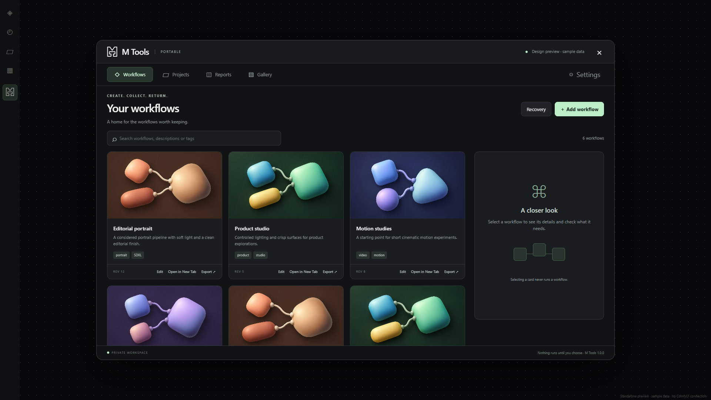

# M Tools

**Your local creative workspace for ComfyUI Portable.** Keep workflows, production records, models and generated outputs organized in one place.

[راهنمای فارسی](README.fa.md) · [Download v1.0.0](https://github.com/maisamh80/MTools/releases/tag/v1.0.0) · [Report an issue](https://github.com/maisamh80/MTools/issues)



## What you can do

- **Workflows:** save the active tab or import JSON; add descriptions, tags and covers; inspect local requirements; open a saved graph in a new tab; edit, recover revisions and export JSON or a model package.
- **Projects:** keep references, prompts, workflow JSON, node settings and final outputs together in an independent archive. Capture the active tab, create a record manually or import an existing project. Models and custom-node binaries are not copied into Projects.
- **Reports:** inspect storage totals and every model directory, including nested folders and empty categories. Search files, see sizes and paths, copy paths and export CSV/JSON reports.
- **Gallery:** browse generated images, videos and other output files; reveal files in their folder; back up selected files or all outputs; permanently delete an output after confirmation.
- **English / فارسی:** switch language in Settings. Persian changes interface text and its reading direction only. Cards, columns and panels keep their positions; filenames, model names, prompts and user content stay unchanged.

## Install — recommended full package

**Target: Windows x64, ComfyUI Portable.** ComfyUI must already be installed and working.

1. Download **MTools-1.0.0-Windows-x64-Full.zip** from [Releases](https://github.com/maisamh80/MTools/releases/latest).
2. Close ComfyUI.
3. Extract the `MTools` folder into `ComfyUI/custom_nodes`.
4. Start ComfyUI with your usual launcher. Open **M Tools** from the sidebar below **Templates**. If the browser has cached the old UI, press **Ctrl+F5**.

```text
ComfyUI_windows_portable/
└── ComfyUI/
    └── custom_nodes/
        └── MTools/
            ├── __init__.py
            ├── web/
            ├── mtools/
            └── runtime/python/python.exe
```

Avoid a double `MTools/MTools` folder. The **Full** release includes its own Python: no `pip`, system Python installation or runtime download is required. GitHub's automatic “Source code” ZIP is **not** the Full package.

## Install from GitHub source

From your `ComfyUI/custom_nodes` directory:

```powershell
git clone https://github.com/maisamh80/MTools.git MTools
cd MTools
powershell -NoProfile -ExecutionPolicy Bypass -File .\scripts\Prepare-Runtime.ps1
```

Source installation needs internet once to download the pinned official Python embeddable archive. Its SHA-256 is verified before extraction. Do not run this preparation step for the Full package or when `runtime/python` already exists.

## Independent by design

The integration bridge runs inside ComfyUI; file operations run in M Tools' private **CPython 3.13.15 x64** process. No packages are installed into ComfyUI's Python, and no core files, launchers, PATH or registry settings are changed. The production frontend uses native JavaScript/CSS; it needs no npm installation, cloud account or AI service. The local API is intended for loopback use.

The default library lives in the plugin's `data` folder. Choose an independent **Projects** archive through Settings; that archive survives uninstall. Choose separate destinations for exports and backups. Capture reports missing/unavailable inputs or outputs rather than inventing them. A project record preserves creative context; it does not by itself certify authorship or establish legal ownership.

## Update and backup

Close ComfyUI and back up the library before replacing code. Preserve `data/`, `.mtools-owner.json`, the existing `runtime/`, and independent Projects archives. **Do not uninstall as an upgrade step.** Runtime files and personal data are excluded from this repository.

## Uninstall

Review **Settings → Uninstall M Tools**. Restore or purge any legacy recovery-bin entries, save your open workflows and close ComfyUI. Then run from the installed `MTools` folder:

```powershell
powershell -NoProfile -ExecutionPolicy Bypass -File .\scripts\Uninstall.ps1
```

The helper validates ownership and removes the plugin, private Python and owned library storage after confirmation. Models, original outputs, external backups and independent Projects archives are retained. This is destructive to the owned library; export anything you want to keep first.

## Compatibility and current limits

Tested with ComfyUI **0.34.0**, frontend **1.51.10**, on Windows Portable. Desktop, Linux and macOS are not supported by this release. Other frontend versions need testing.

- Dependency detection uses explicit loader adapters; unknown/custom loaders can remain unresolved. A model being present does not guarantee that a workflow executes.
- Model exports report custom-node requirements; they do not install custom nodes or their Python dependencies.
- Reports show logical file sizes, not exact filesystem allocation. Huge collections currently use in-memory lists.
- The gallery uses ComfyUI's effective output directory. Video playback depends on the browser's codec support.
- Full uninstall has validation/dry-run coverage; destructive uninstall across all real installations is not claimed as tested.

## Development

Python 3.13 and Node.js are needed for development tests only:

```powershell
python -m unittest discover -s tests -v
npm run check
npm install --ignore-scripts
npx playwright install chromium
npm run test:ui
python scripts/build_preview.py
node tests/bilingual.test.cjs
```

Open `preview/MTools-Preview.html` for an offline demo with sample data. Build a full release using the official runtime ZIP matching `scripts/runtime-manifest.json`:

```powershell
python scripts/package_full.py path/to/python-3.13.15-embed-amd64.zip MTools-1.0.0-Windows-x64-Full.zip
```

The builder verifies the runtime, includes the Python license and excludes personal data. A `.sha256` file accompanies the release.

## Credits

**Design by Maisam Hosaini | [storyeco.xyz](https://storyeco.xyz)**

Bundled Python retains its own license at `runtime/python/LICENSE.txt`. No open-source license has yet been assigned to M Tools itself; public source availability is not a grant of an unrestricted reuse license.
